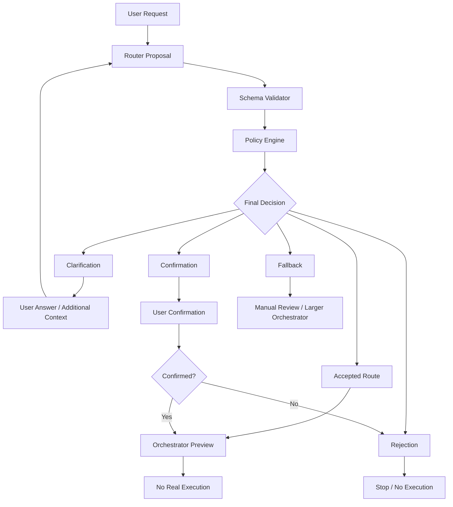

# Architecture

The router proposes a route, but validation and policy decide the final state. Clarification loops gather missing context and route again. Rejected requests stop without execution, and fallback requests move to manual review or a larger orchestrator. Accepted or confirmed routes generate previews only; the orchestrator does not execute real cloud or infrastructure actions.
